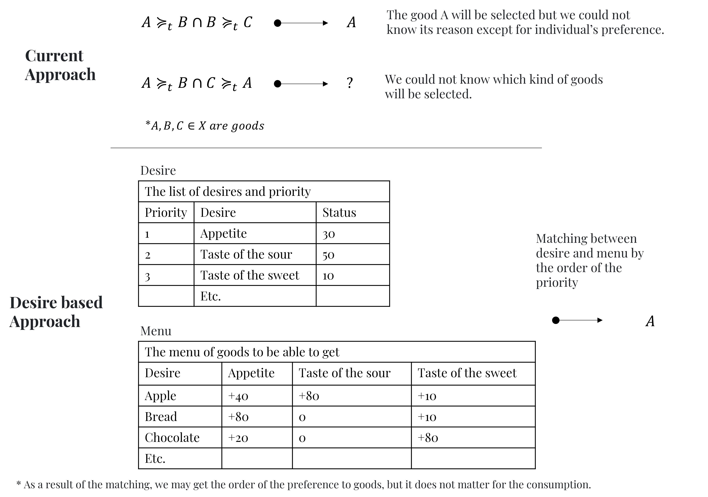

# 1. Introduction

## 1.1 Economics for Digital Twin

Digital Twins is a virtual representation of a physical object or system
that leverages real-time data, advanced analytics, and simulation
techniques to provide insights, support decision-making, and optimize
performance throughout the lifecycle of the object or system. Based on
the Digital Twin, various technologies such as Internet of Things (IoT),
sensors, data analytics, artificial intelligence (AI), and virtual
reality (VR) are used. They enable the collection of real-time data from
the physical object or system, which is then used to create a virtual
counterpart that mimics its behavior and responds to changes in
real-time.

Economics for Digital Twin is the measure with Digital Twin technologies
to analyze the real economy through the virtual economy. With the
difference from the most economic model, the goal not is to give the
good explanation for the economy through the abstracted and simple model
but to copies the real and complex world in the virtual machine. The
start point of this measure is completely different from canonical
economic models.

The reason of the difference with the canonical economic model is from
mainly three sides. The first one is that Digital Twin model has the
geographical limitation. In the most canonical economic model, they
often focuses on the market that give a price to good from the quantity
of the demand and the supply, and the other factors, such as the
geographical setting up, in the canonical model is simplified too much.
So we cannot identify why a same kind of a good has different costs and
need longer time to be supplied to a market. The geographical limitation
also produce the difference in the resources and environments of nature
for each areas and so it can bring us to expand the possibility of more
precise analysis to weight on the resources that can produce industries
for nations and the relation between economic and nature for the
sustainability.

The second aspects is to focuses on the time limitation. In the
canonical model, the time is often dealt with a term from the starts to
the end. For example, the time *t* in the DSGE model is considered as
the quarterly of the year because the data set for the GDP is releases
by each quarterly of the year. This is the completely correct approach
and does not have any problems to analyze if people always be in the
centralized market. However, in the real world, human need to do
something to take a time, including join in the centralized market. For
example, please imagine a daily life of the normal workers. They have a
breakfast at their home, go to their workplace to work, head to the
market to buy some foods, and go back to their home to have them and go
sleep at their home. Their action needs a time. So they think required
time to do in their decision, not only asset allocation. Of course, if
you want to weigh the result of the activity in the market, you still do
not have to weigh the time limitation. However, as I will explain later
in this paper, sometimes human’s utility will be met outside the market
and even if they do not pay money, such as walk around good places. In
the canonical model, these activities in the human is not focused on.

The third aspect is to focuses on the human limitation. Human beings
cannot get full information to the world where they live, and memorize
all of them. Also, they cannot move from a place to another faraway
place in the blink of eye, and fly to the sky and spaces without a
airplane and a rocket. These limits a menu of their actions and
decisions in the real world. As a matter of course, there is no superman
in the real world.

These three limitations, a geographical limitation, a time limitation
and human limitation, is the major limitation in the Digital Twin
economic model and improve analysis for economics. Also, they can bring
us other benefits because these limitation make economic model more
realistic.

The first one is the counter-factual simulation. that most economics
papers tackle is easy to be executed and we can get more sophisticated
results.

The second one is that Economics for Digital Twin are expected to be a
platform for the sociological areas, such as sociology, education etc.
In the most economic models, they have focused on the analysis of the
economy, including macro economic model. However, in the present time,
the analysis of economics will be wider and it is difficult to analyze
the activity of the economy in the only knowledge for the economics. So
we need to model that integrates with various sociological models.

## 2 Utility for Digital Twin

### 2.1.1 current consumption model

In the canonical model, the demand function is derived by the maximized
utility subjected to the budget constraint, such as the simple case;

$$
\begin{aligned}
&\max\_{C\_t,B\_{t-1}} \sum\_{t\in T} U(C\_t)\\\\
&s.t. \quad C\_t+B\_{t}= Y\_t+(1+r\_t)B\_{t-1}
\end{aligned}
$$
where *C**t* is the consumption, *B**t* is the
risk-free rate bond and *Y**t* is the production at the time
of *t*. And we are going to get the dynamics in the consumption
“Permanent income hypothesis”;

$$
\begin{aligned}
&C\_{t} =\frac{r}{1+r}\bigg(B\_0+\sum^{\infty}\_{t=0}\bigg( \frac{1}{1+r}\bigg)^t Y\_t\bigg) \\\\
\end{aligned}
$$
From the equation, we can get what the current consumption depends on
the sum of the future income/products. In this model, the change in the
income will make the consumption change, which means this model focuses
on the production. So we can consider this model as the supply-side
economic model.

This concept will be able to apply for the ideal economy that has always
the quantity of the demand and supply or people will consume however
much quantities production are there. That means over supply and demand
does not happen essentially in this model.

This optimal allocation problem mainly imply the following three
interpretations.

**Points**

1.  The amount of the consumption depend on the budget and collateral
    constraints

2.  The amount of the consumption depend on the interest rate

3.  The amount of the consumption depend on the wage

**Implications**

-   The amount of the consumption will increase if the interest rate
    goes down

-   The amount of the consumption will increase if the wage goes up

**Philosophy**

Human beings thinks about the optimal allocation for their asset within
each periods. Specifically, under the rational expectations, they think
about the amount of the optimal consumption.

**Cons**

-   You need to solve more complex optimal problem fi you want to add
    variety constraints to your model.

-   Coherently, the supply decides the demand. (If the supply goes up
    over times, then the consumption will goes up as well)

### 1.2.2 new consumption model for Digital Twin

The approach of the optimal allocation for the maximization of the
utility is required to solve the asset allocation model for every time.
So this way does not fit the Digital Twin model that I will create in
the following reason.

First, it needs a lot of time to get the solution from the complex
utility function. This approach is required to get the rigor equilibrium
in the economic model and so we need solve the multiple equation every
time. However, in the Digital Twin model, human beings need to make
their decision on consumption or something because the time limitation
is crucial for their decision. So I consider that the optimal allocation
is the ideal result of the optimal decision, but the model of the human
activities do not need to lean to it. Instead of that, we propose
another approach to replicate their decision making.

# 3. Proposition

## 3.1 Desire-based utility

I assumed that human beings have some desires that push them to do
action for something. For example, the reason why human beings get and
have a food is for their appetite. Also, the reason why they completely
stop their activities and take a rest at the night is the desire for
their sleep. Like this, the action of human begins is ruled by their
desire.

Besides, their desire determined their consumption activities. If they
faces the situation that they get a bread and a vegetable and they can
eat only either one, they will choose to have a bread because it make
their hungry get away from them much more than they have a vegetable.

Also, in the case of the multiple desire, we can see the activity of the
more complex consumption. If there are three desire such as the
appetite, the desire of the sweet and the desire of the sour. When a
person who want to meet the desire of the sour now because today is the
hottest day is there and he get sweets and lemons, which food he will
have at first? Yes. He will have a lemon at first. However, after he
have a lemon, if he is still hungry, which food he will have at the
next? If his desire of the sour is not enough, he will have lemon as
well. However, If his desire of the sour is enough, he will have sweet.
Of course, he is not hungry, there does not happen anymore.

This complex consumption cannot be explained with the dynamic preference
because it focus on the result of the consumption with revealed
preference. However, in the reality, the dynamic preference are existed,
and it depends on the desire of human beings.

\[Definition\] A desire is a measure that animals, including human
beings, decide to prefer one to another in the demand of goods and
services at a time. Therefore, a desire itself cannot show someone’s
preference. However, if those get a menu list of goods and services that
they can get, the order of their preference is decided based on a menu.

This means that we can know someone’s preference from the observation,
so-called “revealed preference”, but we cannot get inner preference in
their mind. Therefore, I think we cannot decide them to prefer something
to another thing before they know there are things. This also can say
that the demand is decided by the original desire of animals, not by
something in the world, “Demand-centered” utility.

This can get a explanation why a good and another one is substituted.
For example,

\[For simulation\] For the Digital Twin simulation, we need to decide
which kind of desires we need to include in the model. You should ask
antholopologist and nutrician.

\[Model\] First of all, Desire for a factor *x* ∈ *X* at time *t* has
the lower and upper threshold.
$$
\begin{aligned}
Desire\_{\\{ x,t\\}} \in\[0,100\]
\end{aligned}
$$
Next, Desire will be decreasing over time automatically without any
events.

$$
\begin{aligned}
Desire\_{\\{x,t\\}}= \alpha\_{\\{x\\}} Desire\_{\\{x,t-1\\}}+\varepsilon\_t
\end{aligned}
$$
where *ε**t* is the exogenous variable that depends on some
events.

And, the level of the utility for a person is determined by the
combination of desires. So, the level of the utility of a person
*n* ∈ *N* is
$$
\begin{aligned}
u^n\_{t}=U\bigg(\bigcup\_{x\in X} Desire\_t \bigg)
\end{aligned}
$$
where a function of *U*(⋅) is a utility function.

Note that the time *t* for this setting means the **delta time** like
one second in the real world, and so, for example, the yearly amount of
the consumption is represented as
$$
\begin{aligned}
u\_{Year} &= \sum^{31,536,000}\_{t=0} U\bigg(\bigcup\_{x\in X} Desire\_t \bigg)
\end{aligned}
$$
because
$$
\begin{aligned}
1(sec) \times 60 (minutes) \times 60 (hours) \times 24 (days) \times 365 (Year) = 31,536,000.
\end{aligned}
$$
Also, *ε* means something to meet desires. It does not matter whether
they are goods or services such as a food, electronics, entertainment or
something like that. However, each person have the priority which desire
he/she should meet at first. Especially, the desire of sleeping and
desire of the eating (appetite) is need to be met to live a life for all
of human beings.

## 3.2 The revealed preference and consumption to meet the desire

In the previous, I discussed the origin of a preference and set them as
a desire. In this section, I proposed the system to decide preference
and consumption to desire.

At the demand centered model, those who have a combination of a desire
do not have any specific an order of a preference for goods. However,
when they see a menu of goods, their preference will be revealed. This
system is an revealed preference system in the deman centered model.

When they meet an menu of goods, they choose one based on their priority
of desire to meet. At the background on it, their desire matching
mechanism will work. For example, a menu has a sweet, an orange and a
chair. If those who want to meet an appetite at the first of their
priority see this menu, they does not choose a chair. And then, those
who want to meet an sour at their second priority, they will pick an
orange out of menu. In this case, the order of their preference will be
$$
\begin{aligned}
orange \succ sweet \succ chair
\end{aligned}
$$

In this case, if an orange is run out, will they choose sweet out of the
menu? To answer this problem, we need to discuss the cost of the time to
get an orange. If they have a time to go to another shop which have some
orange, they will go there. However, If not, they will not.

Let us another example, there are people who have the same priority
order of desires, and then there are also orange, apple, and lemon. As
you recognize, orange, apple and lemon are foods and have tastes of the
sour. In this case, how will people decide to choose one out of them?

Fortunately, at the progress of the modern science, we can get the
specific level of the nutritious of the food. Which means that we can
identify which one have the most sour food among them. So we can give
calories and the level of sours and sweet to these foods. So we also
have those have an appetite, the desire of sours and sweet.

From these information, we can assume how people will decide to chose,
such as two measures. The first one is their priority centered measure.
In this way, they will meet their desire in their prioritized order of
desire. For example, In the case of what their most prioritized desire
is the appetite and there are an orange which has 100cal, an apple which
has 150cal and lemon which has 50cal, they will choose an apple because
it has the most energy.

Another way is matching-mechanism-centered measure. In this way, they
will meet their desire in the way of matching. For example, Assume that
their desire of sour and that of sweet are indifferent. And their level
of the desire of the sour is 50 and that of sweet is 80 and there are an
orange which has +75 sour and +20 sweet, an apple which has +50 sour +
40 sweet, and lemon which has +100 sour and +0 sweet, they will choose
some food based on the maching mechanism.

## 3.3 Goods which acceralate consumption to meet desire

Out of goods, there are some goods which are useful for us to make our
lives better and change our lives, such as transportation goods like a
car, machines like a refrigerator.

In the DSGE model, all goods that people consume are final goods.
However, these goods, especially industries provide are not hold for
these final goods. For example, if you buy a car, the DSGE and statistic
in GDP will include the data of the transaction with an price on it.
However, in the DSGE model, the effect of what they buy a car is all of
that. Anything does not happen more. However, in the reality, if they
buy a car, they can go anywhere speedily, which mean that will bring us
changing consumption speed, efficient consumption, and sometimes new
consumption to meet new desire, such as an sightseeing and the
opportunity to get local goods. This also can expand the amount of the
consumption.

These goods are almost durable goods, but is not always one, such as an
eraser which cannot affect human utility at all but it is consumed if
you will use it. So we should use the idea of the depreciation for these
goods.

    IF (Desire <= Threshold) THEN
      epsilon_t >0
    ELSE
      epsilon_t =0
    END

1.  Meet the desire according to the order of their priorities
2.  Deposit residual something
3.  Borrowing something if there are some lacks
4.  Checking the account whether it is deficit or not at each quartely
    period
5.  Cannot borrow something if someone pay back their borrowing in a
    year.

**Implication**

-   Priotize the desire or the demand. If there is no desire, human will
    not consume something

-   Under the setting, The amount of the consumption will increase if
    the interest rate goes down

-   Under the setting, The amount of the consumption will increase if
    the wage goes up

test

## 3.3 How to coincidence with the supply and the demand

In this setup, we do not get the demand function from the optimal
problem that we generally derive in a standard model. So, we need to
find another way to get the coincidence with supply and the demand.

$$
\begin{aligned}
Price\_t=\frac{Q\_{S,t}}{Q\_{D,t}}
\end{aligned}
$$

where the amount of the demand *Q**D* by the demand, the are
of the amount of the supply *Q**S* by the supplier.

### 3.3.1 Decentralized Trading

In Decentralized trading, the amount of the demand depends on the
preference from someone you meet.
$$
\begin{aligned}
The\\ quantity\\ of \\ the\\ demand &= \frac{100-current\\ desire}{preference\_i}
\end{aligned}
$$

where *a**l**p**h**a**i* is the individual preference to meet
desire. For example, there is an apple that only affect only one desire.
Also, current desire is 20. So he want to meet 80 desire to make up to
full desire from now on. Also, there are diverse preference for apple by
each person, such as person A feel like 25 desire for each apple when he
have an apple, also person B feel like 15 desire for each apple. This
preference may be curve such as a utility function but for simplicity, I
assume they are an linear increment desire.

Also, there is a multiple case desire. For example, when you have an
apple, it might make increase your two desire, such as your appetite and
your desire for taste of sweetness. In this model, you can make the
activity for consumption more complex, such as you will have apple not
curry because you need to meet both of the appetite and taste of sweet.
This model for the complex consumption activities also leads to
integrate with the Input-Output Table analysis that deal with diverse
goods and services in Digital Twin model.

Note that in the multiple case desire, if you can make one of your
desire up to 100 at least, you are satisfied with your consumption.
Therefore,

$$
\begin{aligned}
The\\ quantity\\ of \\ the\\ demand\_{\\{a\\}} &= \min \bigg\[ \frac{100-current\\ desire\_{\\{a,i\\}}}{preference\_{\\{a,i\\}}} \bigg\]
\end{aligned}
$$

### 3.3.2 Centralized Trading

Centralized Trading

# 4. Further Discussion

## 4-1. Fiat money

# 5. Conclusion

# 6. Appendix

## 6-1 Data of the consumption for the food

Then,m, we propose the new approach of the utility for the Digital Twin
economic model.

The optimized utility make model supply sides intrinstically because.
Therefore, the RBC model is the supply sided model and New Keynesian
Economic model is the supply sided model with price flactuation by the
ad-hock sticky price.

This

Human beings act is not the optimal allocation for their working time
and assets because they do not know all of things tasks and assets that
they have or will have. They prioritize their tasks and act by the order
of their priority every time.

Aim:

-   Build the model like DSGE

-   Build the utility based on the desire not maximized utility to use
    Digital Twin analysis
